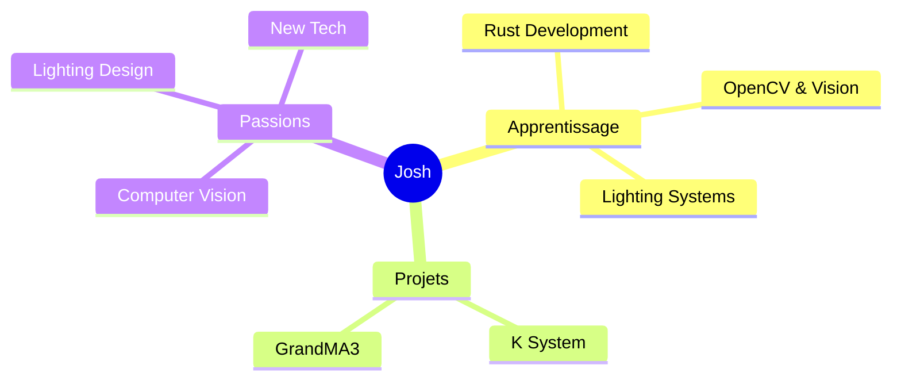

<div align="center">

# Josh


---

## 🎨 Stack Technique

<div align="center">

### 💻 Langages


### 🛠️ Outils & Frameworks


</div>

---

## Github Stats

<div align="center">
  


</div>

<div align="center">
  


</div>

---

## Mindmap

<div align="center">



</div>

<table align="center">
<tr>
<td align="center" width="33%">

**Rust**
<br/>
Learning & Building
<br/>
*Systems Development*

</td>
<td align="center" width="33%">

**OpenCV**
<br/>
Computer Vision
<br/>
*Tracking*

</td>
<td align="center" width="33%">

</td>
</tr>
</table>

---

## Naostage

<div align="center">

**Tracking System**

```diff
+ K System: Tracking System based on AI Kapta / Kore / Kratos 
+ GrandMA3 Plugins: Console lighting management
```

[](https://github.com/Naostage)

</div>

---

## Contact

<div align="center">

[](https://github.com/MayBeLinux)
[](https://github.com/Naostage)

<br/>


</div>

---

<div align="center">


</div>
