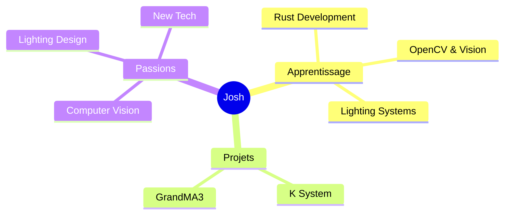

<div align="center">

# 👋 Salut, je suis Josh


<br/>
---

## 🧊 À propos


```rust
struct Developer {
    name: &'static str,
    role: &'static str,
    company: &'static str,
    learning: Vec<&'static str>,
    passion: &'static str,
}

impl Developer {
    fn new() -> Self {
        Self {
            name: "Josh",
            role: "LED Systems Developer",
            company: "Naostage",
            learning: vec![
                "Rust 🦀",
                "OpenCV 📷", 
                "Computer Vision",
                "Lighting Systems"
            ],
            passion: "Creating innovative LED solutions",
        }
    }
}
```

<br clear="right"/>

---

## 🎨 Stack Technique

<div align="center">

### 💻 Langages


### 🛠️ Outils & Frameworks


### 🎯 Spécialisations


</div>

---

## 🚀 Projets en cours

<div align="center">

<table>
<tr>
<td width="50%">

### 💡 K System LED
```python
# Calibration au sol + Tracking
class KSystem:
    def calibrate(self):
        self.thermal_tracking()
        self.display_optimize()
```
**Tech**: Python • Kapta • GrandMA3

</td>
<td width="50%">

### 🎛️ GrandMA3 Plugin
```python
# Console lighting management
class MA3Plugin:
    def manage_projectors(self):
        self.optimize_values()
        self.sync_display()
```
**Tech**: Python • GrandMA3 • DMX

</td>
</tr>
</table>

</div>

---

## 📊 Statistiques GitHub

<div align="center">
  


</div>

<div align="center">
  


</div>

---

## 🎯 Focus Actuel

<div align="center">



</div>

<table align="center">
<tr>
<td align="center" width="33%">

🦀 **Rust**
<br/>
Learning & Building
<br/>
*Systems Development*

</td>
<td align="center" width="33%">

📷 **OpenCV**
<br/>
Computer Vision
<br/>
*Tracking*

</td>
<td align="center" width="33%">

</td>
</tr>
</table>

---

## 🏢 Naostage

<div align="center">

**Développement de systèmes LED innovants**

```diff
+ K System: Tracking System based on AI Kapta / Kore / Kratos 
+ GrandMA3 Plugins: Console lighting management
```

[](https://github.com/Naostage)

</div>

---

## 🤝 Contact

<div align="center">

[](https://github.com/MayBeLinux)
[](https://github.com/Naostage)

<br/>


</div>

---

<div align="center">


</div>
